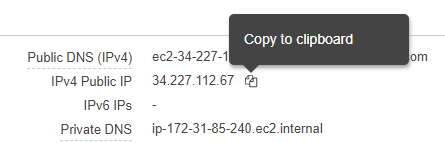
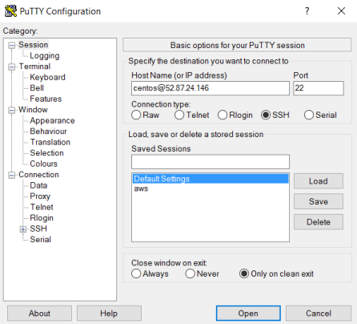
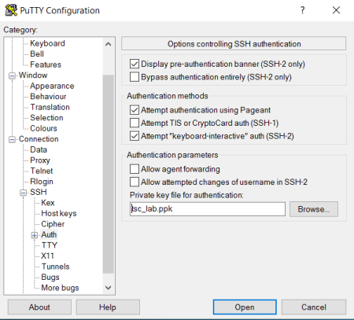
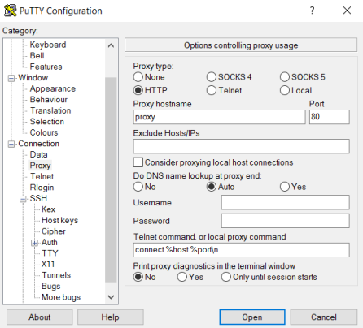
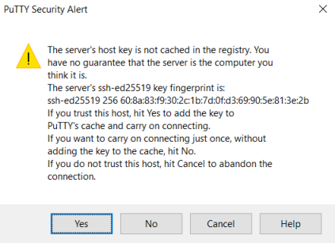

# Xilinx  ML Suite TSC Lab 2018

## Introduction
Welcome to the Xilinx ML Suite TSC Lab. By completing this lab, you will gain valuable hands on experience with using the Xilinx ML Suite. This lab covers how to use the Python APIs for deploying the included models, and how to compile and quantize custom models with the xfDNN Python tools.

The lab is in two parts:
Part 1: Using the Python APIs to run the included Image Classification examples with GoogLeNetv1 and pre-quantized 8-bit model.
Part 2: Using the xfDNN tools to compile and quantize a custom model to be used with the Image Classification example in Part 1.

This lab will follow tutorials from the [Xilinx ML Suite][].

## Launching Your ML Suite Instance

In this lab you will start a pre-configured EC2 F1 instance and connect to it using a ssh client. Once connected, you will be able to run the labs in Parts 1 and 2.

For this event, each registered participant has been attributed a preconfigured EC2 F1 instance and should have received an email with the following details:

- Account ID
- IAM username
- Link to access a preconfigured EC2 F1 instance

If you have not received that email, please contact an Xilinx event staff member now.

#### Start a preconfigured EC2 F1 instance

1. Open the above mentioned email containing your connection credentials.

2. Click on the link to your preconfigured instance.
    - You will be asked to sign-in before accessing your instance in the AWS EC2 Console.

3. In the AWS sign-in page, enter the **Account ID** which was emailed to you

4. Click **Next**.

5. Enter the **IAM user name** which was emailed to you.

6. Enter the **Password** provided at the event.

7. Click **Sign In**.
    - You should now be logged in the AWS EC2 Console and you should see an **f1.2xlarge** instance in the **stopped** state.

8. Start the instance by choosing the **Actions** button, then select **Instance State** and then **Start**.

    

    - Allow about 10 seconds for the instance to start and be in the **Running** state.
    - If needed, click the **Refresh** icon () in the top-right corner of the EC2 Console to update the instance status information.

9. Once the instance is running, find and note the **IPv4 Public IP** address of your instance.
    - You will be using this IP address to connect to your instance.
    - The **IPv4 Public IP** address is displayed in EC2 Console next to the instance status. Copy the IP address.

    

#### Connect to your instance using a ssh client

The instance you just started can be connected to by ssh. You can do this in Windows or Linux.

##### Linux
1. Open a Terminal.

2. Download [tsc_lab.pem][] and save it in your current working directory.

3. Execute the following ssh connection command:

    Use if you are behind Xilinx Firewall:
    ```sh
    ssh -i tsc_lab.pem -o "ProxyCommand /usr/bin/ncat --proxy-type socks4 --proxy proxy:1080 %h %p" centos@<public-ip>
    ```

    Use if you are *not* behind Xilinx Firewall:
    ```sh
    ssh -i tsc_lab.pem -o centos@<public-ip>
    ```
    Replace `<public-ip>` with the **IPv4 Public IP** address for the instance given to you.

4. Type `yes` when asked if you want to connect
    ```sh
    RSA key fingerprint is f9:f4:05:da:40:99:00:9d:1e:8f:95:de:89:6a:3f:cd.
    Are you sure you want to continue connecting (yes/no)? yes
    ```
You should now be connected to the remote F1 instance running Centos 7.

##### Windows
1. Download [tsc_lab.ppk][] and save it in your current working directory.
2. Launch Putty. If you don't have it, [download from here][].
3. Enter **centos@** followed by your **IPv4 Public Address** in the **Host Name** field. **Connection Type** needs to be set to **SSH** and **Port** should be left to the default **22**.

    

4. Next, on the left under **Category**, click the `+` next to **SSH** and click on **Auth**
5. Click on **Broswe** and provide the path to **tsc_lab.ppk** you downloaded earlier. Leave everything else as default.

    

6. If you are behind the Xilinx Firewall, click **proxy** from the left and select **HTTP** under **Proxy Type**. Leave everything else as default.

    

7. Now Click **Open** at the bottom. A Window will pop up, click **Yes** to proceed.

    

You should now be connected to the remote F1 instance running Centos 7.


## [Start Part 1: Image Classification with Python APIs][]


[here]: tutorials/launching_instance.md
[compiler]: tutorials/compile.md
[quantizer]: tutorials/quantize.md
[Xilinx ML Suite]: https://github.com/Xilinx/ML-Suite
[Batch Classification example]: https://github.com/Xilinx/ML-Suite/blob/master/pythonexample.md
[Start Part 1: Image Classification with Python APIs]: tsc_part1.md
[tsc_lab.pem]: keys/tsc_lab.pem
[tsc_lab.ppk]: keys/tsc_lab.ppk
[download from here]: https://www.chiark.greenend.org.uk/~sgtatham/putty/latest.html
